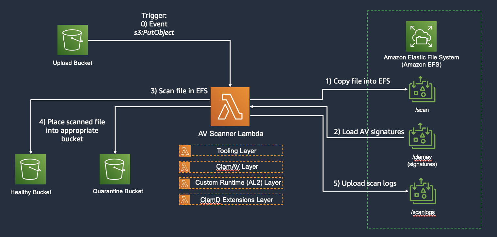
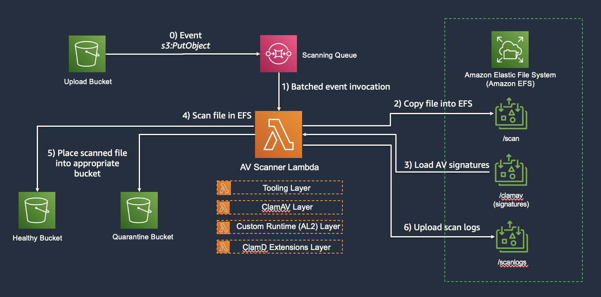
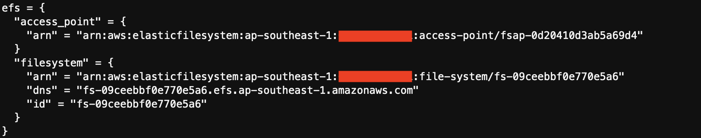

# Serverless ClamAV with Lambda Extensions #

## Foreword ##
Code in this repository is meant for illustrative and demonstrative purposes only. This has not been tested or cleared for deployment into production systems. Please do not deploy wholesale into production. Repo Author do not bear any liability or responsibility for such actions.

## Background ##
This project deploys a Serverless ClamAV Scanner Lambda Function and use it to scan objects being uploaded into S3 buckets. This setup also investigates the use of Lambda Extensions to enhance scanning performance.
There are two environments deployed - 1) Base and 2) Plus.

### Base Environment

In "base" environment, ClamAV binaries and libraries are packaged into the Lambda function through the use of Lambda Layers. There are also layers included for tooling (such as AWSCLI) and for the custom runtime itself (ie. provided al2).
Upon receiving a file upload into the UploadBucket, the Scanner Lambda function will be invoked to carry out the following actions:

1. Download the file to be scanned and place it into Amazon EFS under the /scan path
2. Run clamscan or clamdscan (depending on function) utilising AV signature databases stored in Amazon EFS under the /clamav path.
3. Store scan logs into Scanlogs S3 bucket.

The "base" environment sets up two functions:
- AVScan-Lambda-Alpha
- AVScan-Lambda-Delta 

The Alpha variant makes use of clamscan as the scanning client while Delta variant makes use of clamdscan. The Delta variant will also include the required Lambda Extensions layer.
In the Delta variant the Lambda extensions include code that initializes the ClamAV Daemon as part of Extension initialization.

### Plus environment

While largely similar to the base environment, the "plus" environment includes an SQS queue to receive S3 event notifications instead of having them directly invoking the AWS Lambda Function. Amazon SQS invokes the Scanner Lambda through an event source mapping which has a batching function. The batched results will invoke the function once, and the function carries out batched scanning.

The "plus" environment sets up a single Lambda function:

- AVScan-Lambda-Deltaplus

### Setup Instructions

Pre-requisites:
1. Clone repository from github via this command

        git clone https://github.com/ftseng-aws/clamav-aws-lambda.git

2. Note that there is no IAM credentials provided into the main.tf file. You will either need to add your own IAM access key and secret access key into the .tf file or run this on AWS Cloud to utilise IAM temporary credentials.
3. Change your working directory to ./clamav-aws-lambda/base/tf/:
        
        cd clamav-aws-lambda/base/tf/

4. Open up the file "resource.tf".
5. Comment out the resource titled "module standard_ec2_fleet" for now.
6. Deploy the terraform resources:

        terraform init
        terraform apply -target module.standard_public_private_zone --auto-approve
        terraform apply --auto-approve

7. Once deployment is complete, look into the outputs for the EFS Filesystem Id. It should look something like this:

8. Open "mount-efs.sh" and update it with the filesystem id
9. Go back to "resource.tf".
10. Uncomment out the previously commented out resource "module standard_ec2_fleet".
11. Redeploy the terraform resources. Terraform will only deploy the clamav_admin ec2.

        terraform apply --auto-approve
        
        
More deployment steps to come ........
