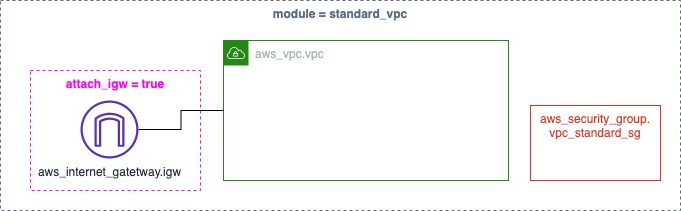
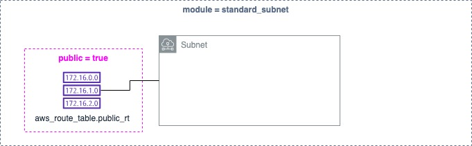
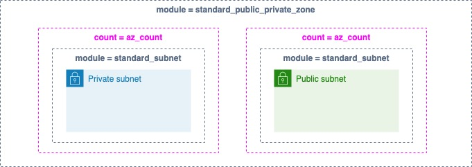

# 1 Networking Modules List 

## 1.1 VPC

### 1.1.1 Standard VPC

Standard VPC creates the following resources :  

- 1 x VPC with DNS Hostnames and DNS resolution enabled.  
- 1 x security group that allows inbound access to the VPC CIDR's range.
- [optional] If the attribute 'attach_igw' is set to true, 1 x internet gateway will be created and attached to the VPC

<!--__Inputs__-->

<!--    variable vpc_name {-->
<!--        description = "vpc name"-->
<!--        type = string-->
<!--    }-->
<!--    variable project_name {-->
<!--        description = "project name"-->
<!--        type = string-->
<!--    }-->
<!--    variable vpc_cidrblock {-->
<!--        description = "vpc cidr bloc"-->
<!--        type = string-->
<!--    }-->
<!--    variable attach_igw {-->
<!--        type = bool-->
<!--        description = "attach IGW"-->
<!--    }-->

<!--__Outputs__-->

<!--    output "vpc_id" {-->
<!--       value = aws_vpc.vpc.id-->
<!--    }-->
<!--    output "vpc_arn" {-->
<!--       value = aws_vpc.vpc.arn-->
<!--    }-->
<!--    output "vpc_cidrblock" {-->
<!--       value = aws_vpc.vpc.cidr_block-->
<!--    }-->
<!--    output "vpc_default_rt" {-->
<!--       value = aws_vpc.vpc.default_route_table_id-->
<!--    }-->
<!--    output "vpc_standard_sg_id" {-->
<!--        value = aws_security_group.vpc_standard_sg.id-->
<!--    }-->
<!--     output "vpc_default_sg_id" {-->
<!--        value = aws_vpc.vpc.default_security_group_id-->
<!--    }-->
<!--     output "igw_id" {-->
<!--        value = var.attach_igw ? aws_internet_gateway.igw[0].id : null-->
<!--    }-->

<!--__Code__-->

<!--    resource "aws_vpc" "vpc" {-->
<!--        cidr_block = var.vpc_cidrblock-->
<!--        enable_dns_hostnames = true-->
<!--        enable_dns_support = true-->
<!--        tags = {-->
<!--            Name = var.vpc_name-->
<!--            Project = var.project_name-->
<!--        }-->
<!--    }-->
<!--    resource "aws_internet_gateway" "igw" {-->
<!--      count = var.attach_igw ? 1 : 0-->
<!--      vpc_id = aws_vpc.vpc.id-->
<!--        tags = {-->
<!--        Name = "${var.vpc_name}-igw"-->
<!--      }-->
<!--    }-->
<!--    resource "aws_security_group" "vpc_standard_sg" {-->
<!--      name        = "${var.project_name}-std-sg"-->
<!--      description = "${var.project_name} project"-->
<!--      vpc_id      = aws_vpc.vpc.id-->
<!--        tags = {-->
<!--        Name = replace("{placeholder}-std-sg","{placeholder}",var.vpc_name)-->
<!--        Project = var.project_name-->
<!--      }-->
<!--    }-->
<!--    resource "aws_security_group_rule" "std_ingress_01" {-->
<!--      type              = "ingress"-->
<!--      from_port         = 0-->
<!--      to_port           = 0-->
<!--      protocol          = "-1"-->
<!--      cidr_blocks       = [aws_vpc.vpc.cidr_block]-->
<!--      security_group_id = aws_security_group.vpc_standard_sg.id-->
<!--    }-->
<!--    resource "aws_security_group_rule" "std_egress_01" {-->
<!--      type              = "egress"-->
<!--      from_port         = 0-->
<!--      to_port           = 0-->
<!--      protocol          = "-1"-->
<!--      cidr_blocks       = ["0.0.0.0/0"]-->
<!--      security_group_id = aws_security_group.vpc_standard_sg.id-->
<!--    }-->

### 1.1.2 Standard Subnet

Standard Subnet creates the following resources :  

- 1 x Subnet 
- [optional] If the attribute 'public' is set to true, then subnet will auto-assign public ip and create public route table resources and associate with the subnet.

### 1.1.3 Standard Public Private Zone

Standard Public Private Zone creates the following resources :  

- Multiple copies of public and private subnets based on the attribute 'az_count'.
- Makes use of the module Standard Subnet

